# アーキテクチャ全体図 — レイヤー構成

AstralRecord プラグインは **3 層アーキテクチャ** で構成されています。  
各層は一方向の依存（上位層 → 下位層）のみを持ちます。

---

## レイヤー構成図

```mermaid
graph TD
    subgraph EntryPoint["エントリポイント"]
        AR["AstralRecord\n(JavaPlugin)"]
    end

    subgraph Core["core 層 — プラグイン共通基盤"]
        EM["EventManager\n全イベントを一括管理・登録"]
        CR["CommandRegister\n全コマンドを一括登録"]
        EH["EventHandler\n«interface»"]
        AEH["AbstractEventHandler\n«abstract»"]
    end

    subgraph Feature["feature 層 — ゲーム機能"]
        ITEM["feature/item\n«未実装»"]
        PLAYER["feature/player\n«未実装»"]
        INVENTORY["feature/inventory\n«未実装»"]
    end

    subgraph Infrastructure["infrastructure 層 — 基盤サービス"]
        subgraph Config["設定管理"]
            CM["ConfigManager\nconfig.yml 管理"]
            CP["ConfigProperties\n設定値の型付きアクセス"]
            CK["ConfigKeys\n設定キー定数"]
        end

        subgraph Logging["ロギング"]
            LOG["Logger\nコンソール出力"]
            AL["AuditLogger\n非同期CSVファイル出力"]
            ALR["AuditLoggerRegistry\nLogEntry実装を自動スキャン・管理"]
            LID["LogId\n«enum» ログID定義"]
            LMP["LogMessageProvider\nメッセージ文字列解決"]
        end

        subgraph Database["データベース"]
            subgraph SqlServer["SQL Server"]
                SSM["SqlServerManager\nシングルトン / 接続提供"]
                SSC["SqlServerConfig\n接続情報"]
                POOL["ConnectionPool\nHikariCP ベース"]
                SSU["SqlServerUtil\nSQLユーティリティ"]
            end

            subgraph FileDB["ファイルDB（YAML）"]
                FDM["FileDatabaseManager\nYAML ファイル読み書き"]
                YDS["YamlDiffService\nYAML差分検出"]
                YSR["YamlSnapshotRepository\nスナップショット保存／取得"]
                YSN["YamlSnapshot\n«data class» スナップショット"]
                YDCU["YamlDbConfigUtil\nYamlDB設定ユーティリティ"]
                YDCL["YamlDbConfigLoader\n設定ファイルロード＆キャッシュ"]
                YDCC["YamlDbConfig\n«data class» 設定モデル"]
                YDCK["YamlDbConfigKey\n設定キー定数"]
                YDCA["YamlDatabaseCategory\n«enum» DBカテゴリ定義"]
            end
        end

        subgraph Util["ユーティリティ"]
            YLU["YamlLoaderUtil\nYAMLファイルロード共通処理"]
            CCU["ColorCodeUtil\nカラーコード変換"]
            RU["ReferenceUtil\n参照解決ユーティリティ"]
        end
    end

    %% エントリポイントからの依存
    AR --> EM
    AR --> CR
    AR --> CM
    AR --> SSM
    AR --> FDM
    AR --> YDCU
    AR --> LOG
    AR --> ALR

    %% Core層
    EM --> EH
    AEH --> EH
    EM --> LOG

    %% Feature層 → Core層（将来実装）
    ITEM -.->|extends| AEH
    PLAYER -.->|extends| AEH

    %% Infrastructure内依存
    CM --> CP
    CM --> CK
    SSM --> SSC
    SSM --> POOL
    FDM --> CP
    YDCU --> FDM
    YDCU --> YDCL
    YDCL --> YDCC
    YDCL --> YLU
    YDS --> YSR
    YSR --> SSM
    ALR --> AL
    LOG --> LID
    LOG --> LMP
```



---

## 各層の責務

| 層                   | パッケージ                | 責務                                      |
|:--------------------|:---------------------|:----------------------------------------|
| **エントリポイント**        | `AstralRecord.java`  | プラグイン起動・停止、各層の初期化をオーケストレーション            |
| **core 層**          | `core/`              | PaperAPI のイベント・コマンド登録の共通フレームワーク提供        |
| **feature 層**       | `feature/`           | ゲームルール・ロジックの実装（アイテム・プレイヤー・インベントリ）       |
| **infrastructure 層** | `infrastructure/`    | DB接続・設定管理・ロギングなど、ゲームロジックに依存しない基盤サービスの提供 |

---

## 依存方向のルール

```
feature  →  core  →  infrastructure
```

- `feature` 層は `core` 層・`infrastructure` 層を使用できる
- `core` 層は `infrastructure` 層を使用できる
- **`infrastructure` 層は上位層に依存してはならない**

