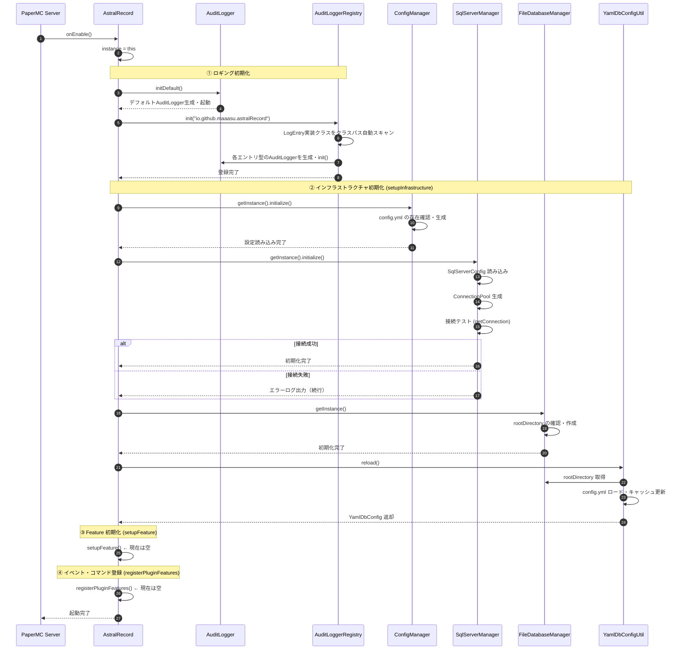
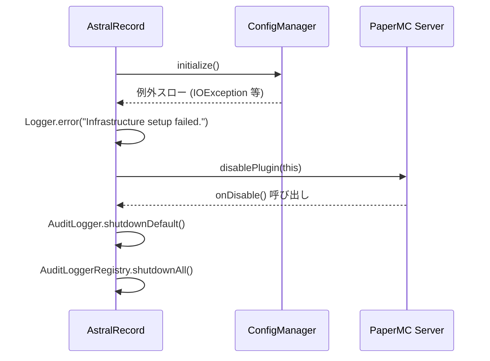
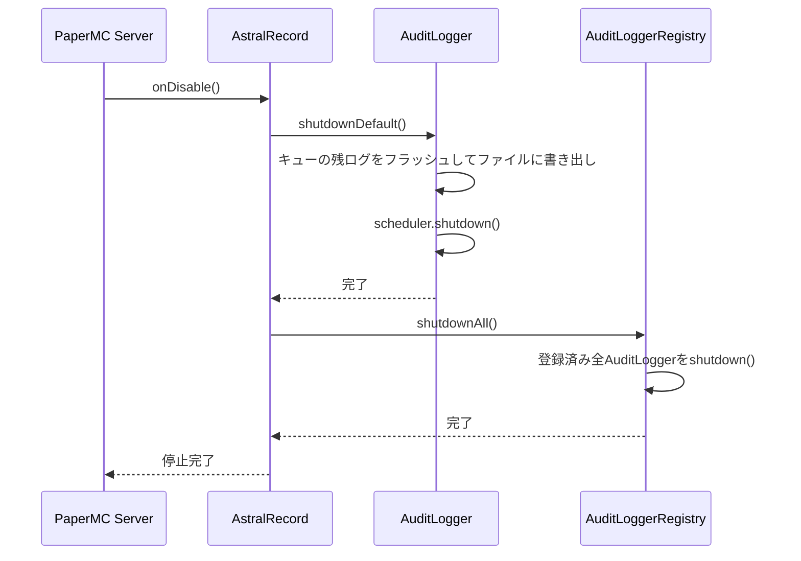

# プラグイン起動シーケンス図

`AstralRecord#onEnable()` が呼ばれてからプラグインが動作開始するまでの処理フローです。

---

## 起動シーケンス

```mermaid
sequenceDiagram
    autonumber
    participant Paper as PaperMC Server
    participant AR as AstralRecord
    participant AL as AuditLogger
    participant ALR as AuditLoggerRegistry
    participant CM as ConfigManager
    participant SSM as SqlServerManager
    participant FDM as FileDatabaseManager
    participant YDCU as YamlDbConfigUtil

    Paper->>AR: onEnable()
    AR->>AR: instance = this

    Note over AR,ALR: ① ロギング初期化
    AR->>AL: initDefault()
    AL-->>AR: デフォルトAuditLogger生成・起動
    AR->>ALR: init("io.github.maaasu.astralRecord")
    ALR->>ALR: LogEntry実装クラスをクラスパス自動スキャン
    ALR->>AL: 各エントリ型のAuditLoggerを生成・init()
    ALR-->>AR: 登録完了

    Note over AR,YDCU: ② インフラストラクチャ初期化 (setupInfrastructure)
    AR->>CM: getInstance().initialize()
    CM->>CM: config.yml の存在確認・生成
    CM-->>AR: 設定読み込み完了

    AR->>SSM: getInstance().initialize()
    SSM->>SSM: SqlServerConfig 読み込み
    SSM->>SSM: ConnectionPool 生成
    SSM->>SSM: 接続テスト (getConnection)
    alt 接続成功
        SSM-->>AR: 初期化完了
    else 接続失敗
        SSM-->>AR: エラーログ出力（続行）
    end

    AR->>FDM: getInstance()
    FDM->>FDM: rootDirectory の確認・作成
    FDM-->>AR: 初期化完了

    AR->>YDCU: reload()
    YDCU->>FDM: rootDirectory 取得
    YDCU->>YDCU: config.yml ロード・キャッシュ更新
    YDCU-->>AR: YamlDbConfig 返却

    Note over AR: ③ Feature 初期化 (setupFeature)
    AR->>AR: setupFeature() ← 現在は空

    Note over AR: ④ イベント・コマンド登録 (registerPluginFeatures)
    AR->>AR: registerPluginFeatures() ← 現在は空

    AR-->>Paper: 起動完了
```

---

## エラー時の挙動

```mermaid
sequenceDiagram
    participant AR as AstralRecord
    participant CM as ConfigManager
    participant Paper as PaperMC Server

    AR->>CM: initialize()
    CM-->>AR: 例外スロー (IOException 等)
    AR->>AR: Logger.error("Infrastructure setup failed.")
    AR->>Paper: disablePlugin(this)
    Paper-->>AR: onDisable() 呼び出し
    AR->>AR: AuditLogger.shutdownDefault()
    AR->>AR: AuditLoggerRegistry.shutdownAll()
```

> `setupInfrastructure()` が `false` を返した場合、プラグインは自動的に無効化されます。

---

## 停止シーケンス

```mermaid
sequenceDiagram
    participant Paper as PaperMC Server
    participant AR as AstralRecord
    participant AL as AuditLogger
    participant ALR as AuditLoggerRegistry

    Paper->>AR: onDisable()
    AR->>AL: shutdownDefault()
    AL->>AL: キューの残ログをフラッシュしてファイルに書き出し
    AL->>AL: scheduler.shutdown()
    AL-->>AR: 完了

    AR->>ALR: shutdownAll()
    ALR->>ALR: 登録済み全AuditLoggerをshutdown()
    ALR-->>AR: 完了

    AR-->>Paper: 停止完了
```

