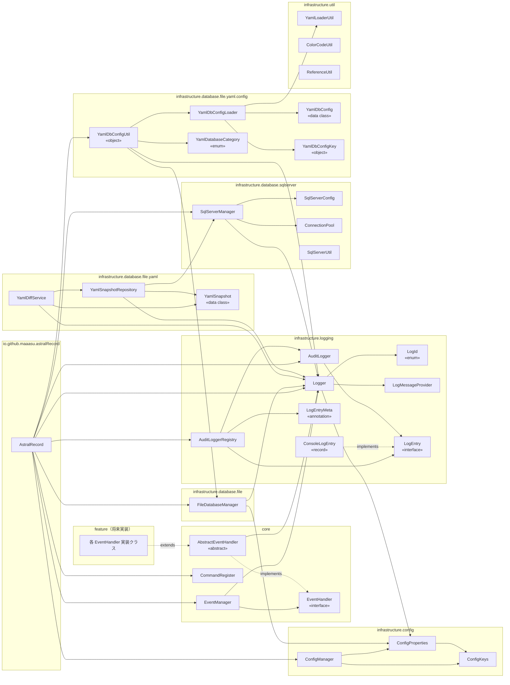
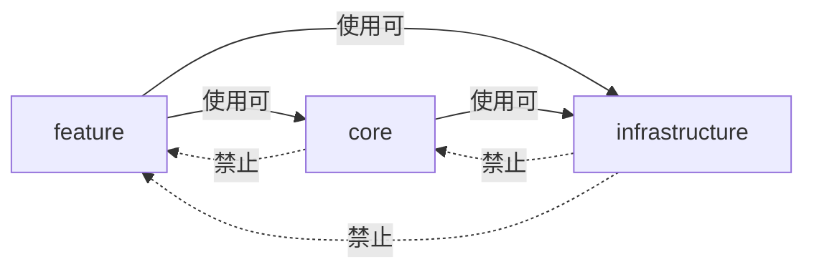

# レイヤー間依存関係図

クラス単位でのパッケージ横断的な依存関係を示します。  
矢印は「依存する（使用する）」方向を示しています。

---

## クラス依存関係全体図

---

## 依存の原則

| ルール | 理由 |
|:------|:----|
| `infrastructure` は `core` / `feature` に依存しない | 基盤層が上位ゲームロジックを知ると循環依存が生まれる |
| `core` は `feature` に依存しない | フレームワーク層が具体的な機能を知るべきではない |
| `feature` はすべての下位層を使用できる | ゲームロジックは基盤サービスを自由に組み合わせる |

