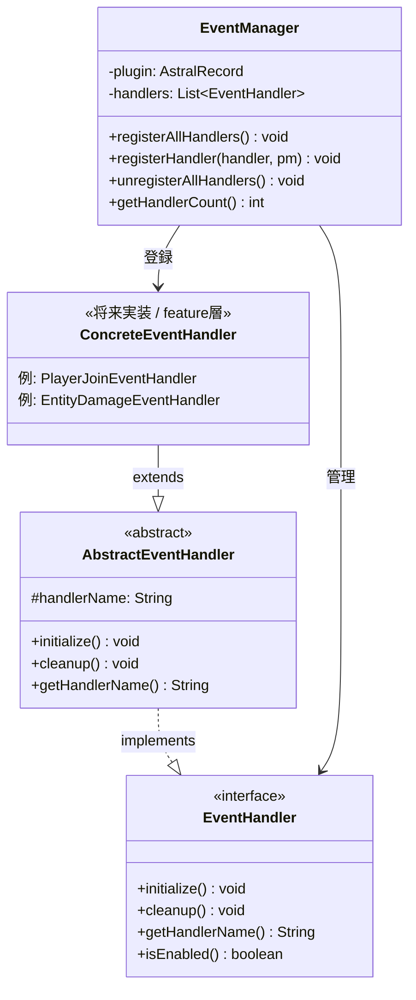
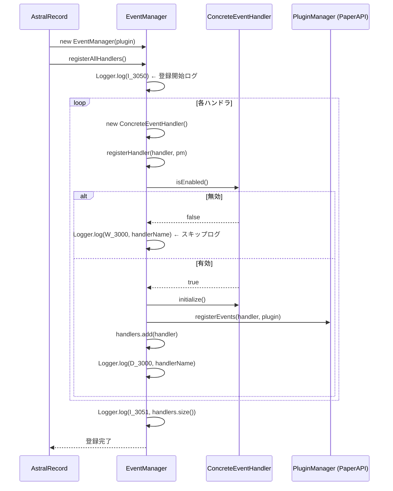
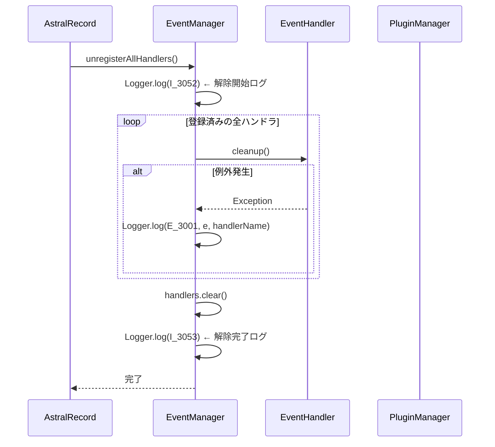
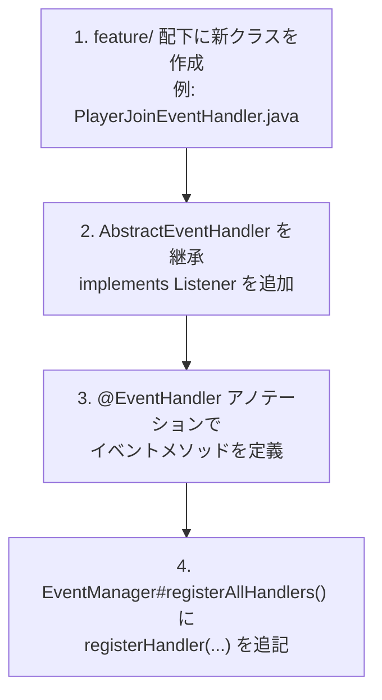

# イベントシステム — 構造図

PaperAPI のイベントリスナーを統一的に管理するためのフレームワーク層です。

---

## クラス構成図



---

## イベントハンドラの登録フロー



---

## イベントハンドラの解除フロー（プラグイン停止時）



---

## 新しいイベントハンドラの実装手順

新しいゲームイベントを追加する場合の実装パターンです。



**実装例（概要）:**

```java
// feature/player/PlayerJoinEventHandler.java
public class PlayerJoinEventHandler extends AbstractEventHandler implements Listener {

    @Override
    public boolean isEnabled() { return true; }

    @org.bukkit.event.EventHandler
    public void onPlayerJoin(PlayerJoinEvent event) {
        // ゲームロジックを記述
    }
}

// EventManager#registerAllHandlers() に追記
registerHandler(new PlayerJoinEventHandler(), pm);
```

---

## LogId 対応表（イベントシステム）

| LogId    | レベル  | 出力メッセージ                        |
|:---------|:------|:----------------------------------|
| `I_3000` | INFO  | イベントハンドラーが初期化されました: {name}     |
| `I_3001` | INFO  | イベントハンドラーのクリーンアップを実行しました: {name} |
| `I_3050` | INFO  | イベントマネージャーを初期化しています            |
| `I_3051` | INFO  | イベントハンドラーを登録しました。登録数: {count}  |
| `I_3052` | INFO  | 全イベントハンドラーの登録解除を開始します          |
| `I_3053` | INFO  | 全イベントハンドラーの登録解除が完了しました         |
| `W_3000` | WARN  | イベントハンドラーが無効のためスキップします: {name}  |
| `D_3000` | DEBUG | イベントハンドラーを登録しました: {name}        |
| `E_3000` | ERROR | イベントハンドラーの登録に失敗しました: {name}     |
| `E_3001` | ERROR | イベントハンドラーのクリーンアップに失敗しました: {name} |

