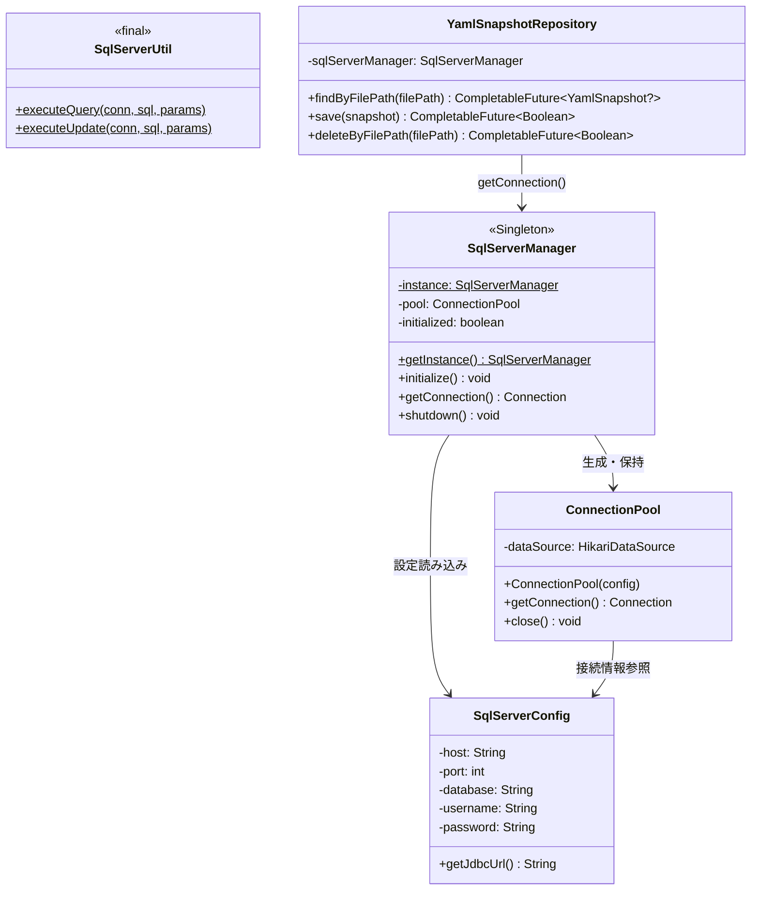
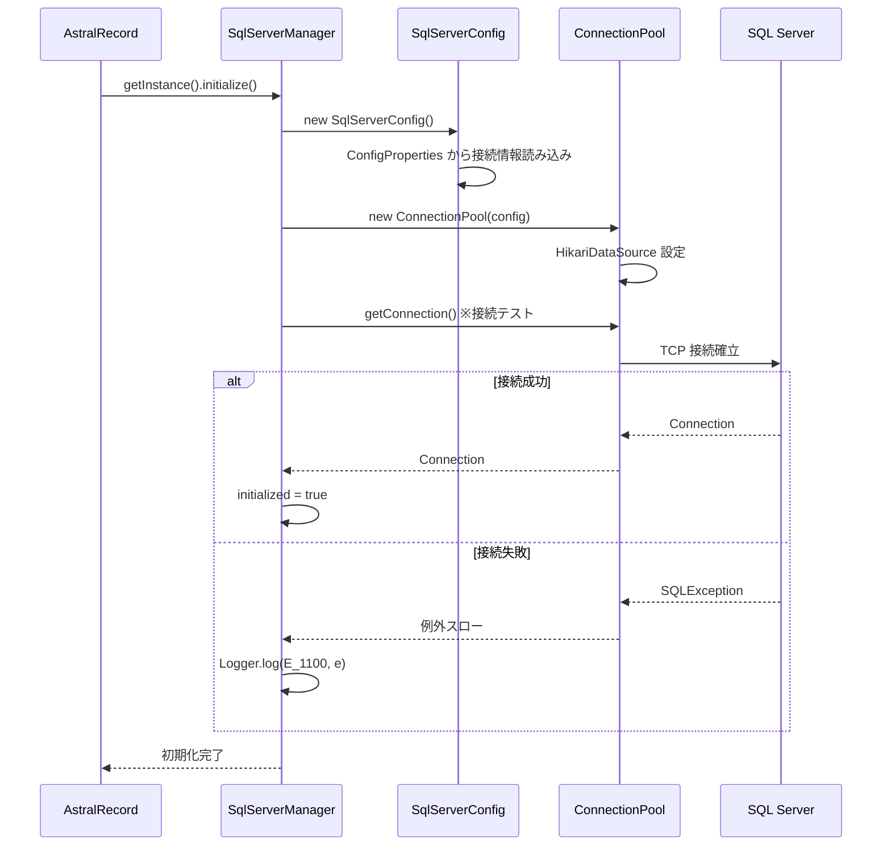
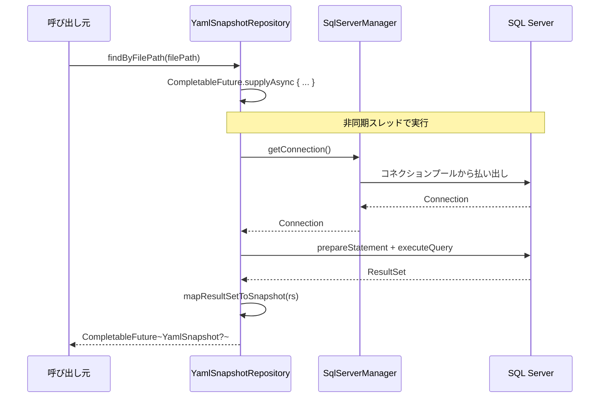

# SQL Server データベース — 構造図

プレイヤー固有の動的データを管理する SQL Server 接続層の構造です。

---

## クラス構成図

---

## 接続初期化フロー

---

## リポジトリパターン

リポジトリクラスは `SqlServerManager.getConnection()` を通じて接続を取得し、  
非同期（`CompletableFuture`）でクエリを実行します。

---

## テーブル定義（参照）

| テーブル名           | 定義ファイル                                         | 概要                     |
|:----------------|:-----------------------------------------------|:-----------------------|
| `yaml_snapshot` | `database/sqlserver/dbo.yaml_snapshot/yaml_snapshot.md` | YAML スナップショット保存テーブル    |
| `account`       | `database/sqlserver/dbo.account/account.md`    | アカウント情報                |
| `user`          | `database/sqlserver/dbo.user/user.md`          | ユーザー（プレイヤー）情報          |

