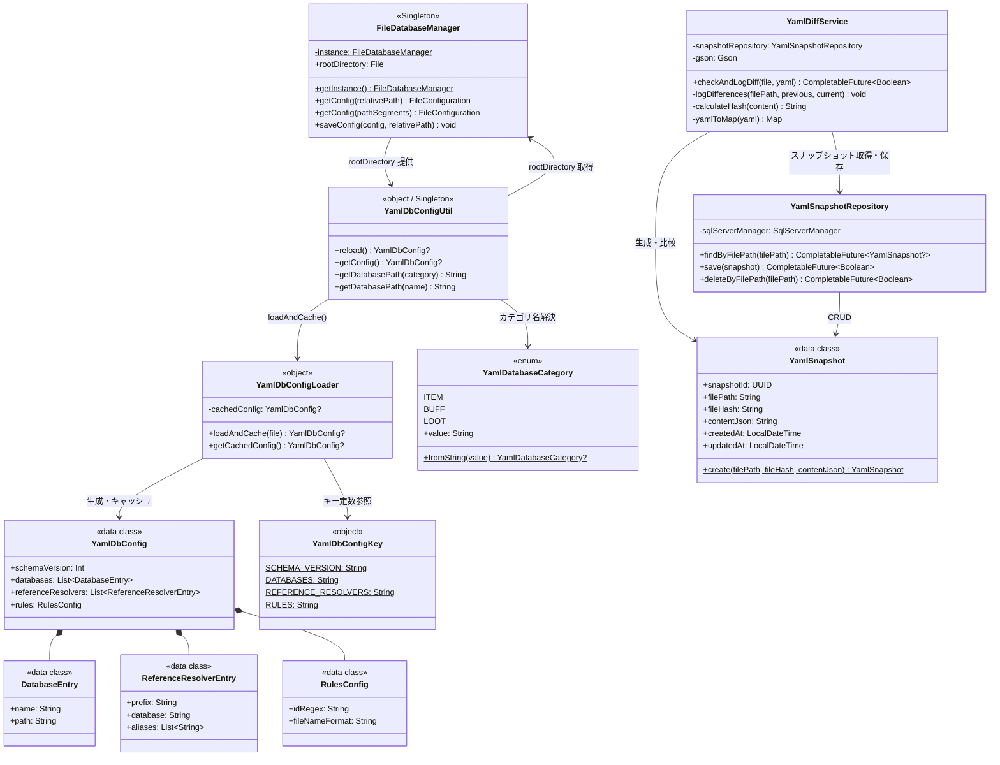
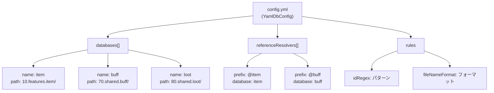
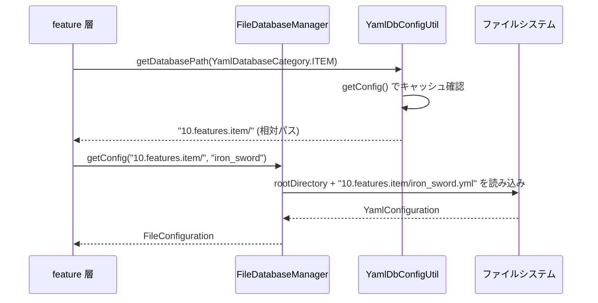
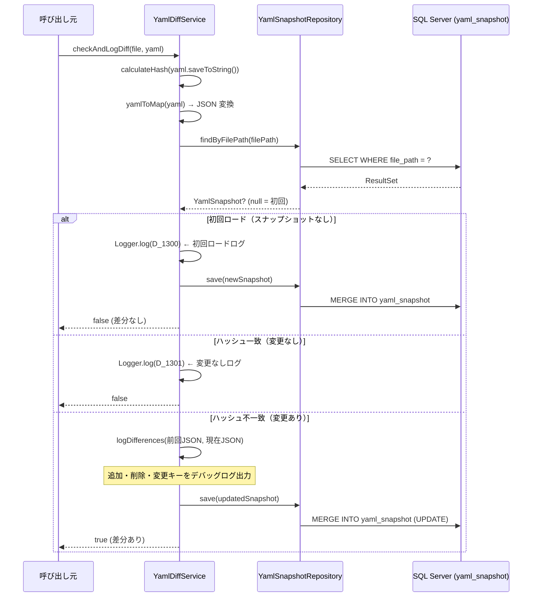

# YAML ファイルDB — 構造図

アイテム定義などの静的マスタデータを YAML ファイルで管理する層の構造です。  
SQL Server と連携した差分検出（スナップショット）機能も含みます。

---

## クラス構成図

---

## YamlDB 設定ファイルの構造 (`database/file/config.yml`)

---

## YAML 読み込みフロー（通常）

---

## YAML 差分検出フロー（YamlDiffService）

YAMLファイルの変更を検出し、前回ロード時との差分をデバッグログに出力します。  
スナップショットは SQL Server の `yaml_snapshot` テーブルに保存されます。

---

## ディレクトリ構成とカテゴリの対応

| `YamlDatabaseCategory` | `config.yml` の `name` | 実際のパス例                        |
|:-----------------------|:----------------------|:--------------------------------|
| `ITEM`                 | `item`                | `database/file/10.features.item/` |
| `BUFF`                 | `buff`                | `database/file/70.shared.buff/`   |
| `LOOT`                 | `loot`                | `database/file/80.shared.loot/`   |

