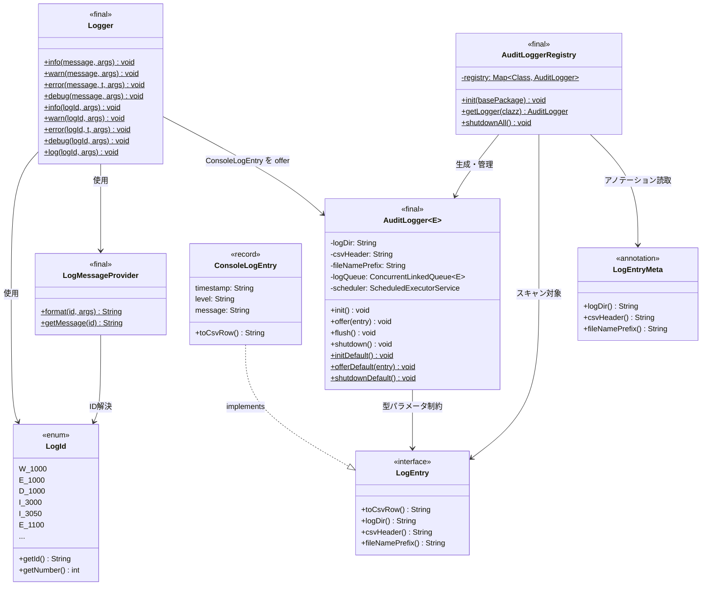
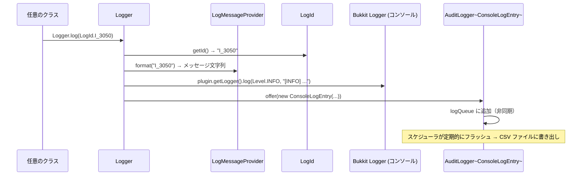
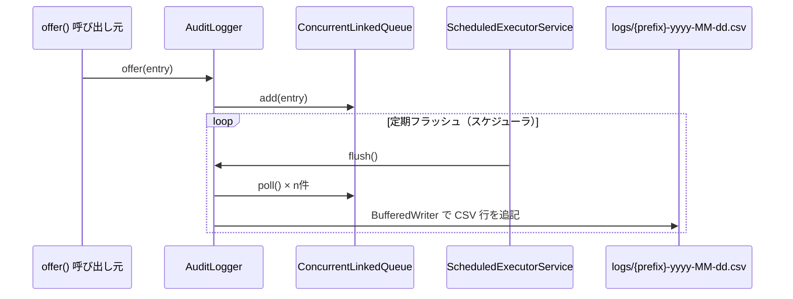
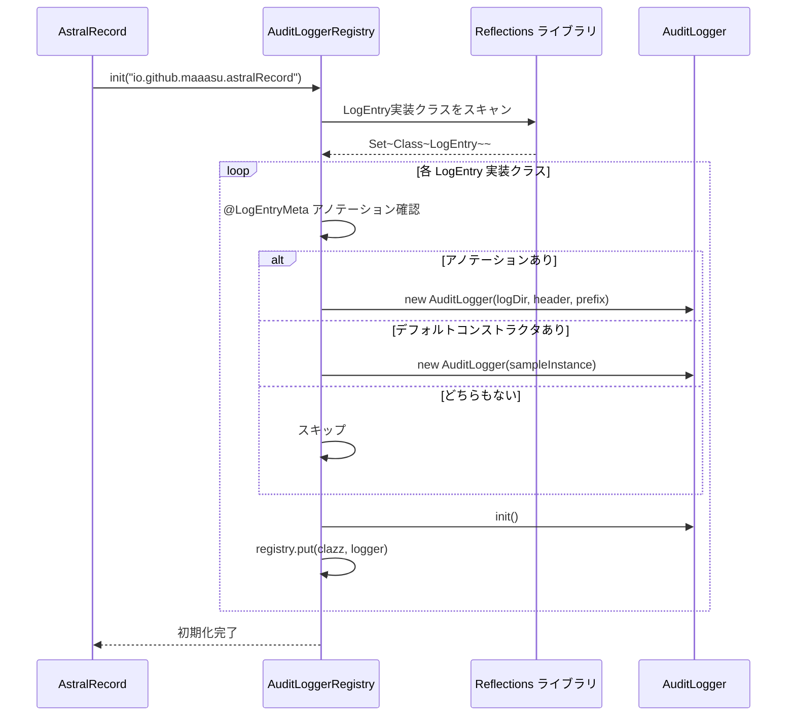

# ロギング機能 — 構造図

AstralRecord のロギング機能は **コンソール出力** と **非同期 CSV ファイル出力（監査ログ）** の 2 系統で構成されています。

---

## クラス構成図

---

## ログ出力フロー（コンソール）

---

## AuditLogger の非同期書き出しフロー

---

## AuditLoggerRegistry の自動スキャンフロー

---

## LogId 命名規則

| プレフィックス | レベル    | 自動ルーティング先 (`Logger.log()`) |
|:-----------|:--------|:-------------------------------|
| `I_`       | INFO    | `Logger.info()`                |
| `W_`       | WARNING | `Logger.warn()`                |
| `E_`       | ERROR   | `Logger.error()`               |
| `D_`       | DEBUG   | `Logger.debug()` ※デバッグモード時のみ出力 |

> 番号帯の割り当て例: `1000番台` = infrastructure/util、`3000番台` = core/event

